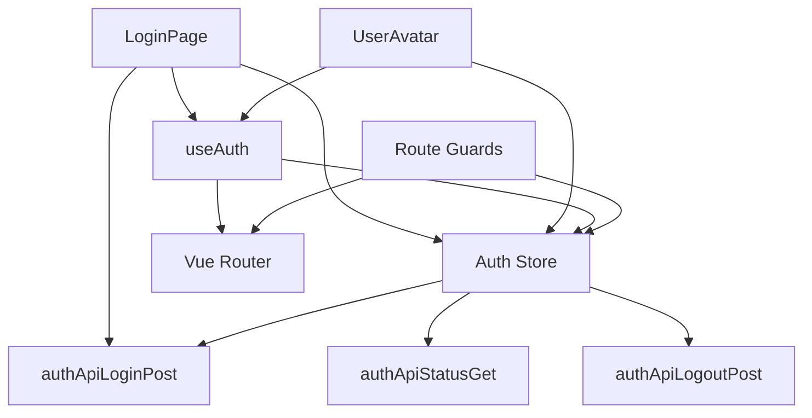

# 登录功能前端界面设计文档

## 概述

本文档描述了教学资源管理系统登录功能前端界面的详细设计。该设计基于 Vue 3 + TypeScript + Ant Design Vue 技术栈，提供现代化、响应式的用户登录体验，包括登录页面、顶部菜单栏用户状态组件、路由守卫和全局状态管理。

## 架构

### 技术栈

- **框架**: Vue 3 (Composition API)
- **语言**: TypeScript
- **UI 组件库**: Ant Design Vue
- **路由**: Vue Router
- **状态管理**: Pinia
- **HTTP 客户端**: 已有的 request 封装
- **表单验证**: Ant Design Vue Form

### 目录结构

```
frontend/src/
├── pages/
│   └── auth/
│       └── LoginPage.vue          # 登录页面组件
├── components/
│   └── common/
│       └── UserAvatar.vue         # 用户头像组件（顶部菜单栏）
├── stores/
│   └── auth.ts                    # 认证状态管理
├── router/
│   ├── auth.ts                    # 认证相关路由
│   └── guards.ts                  # 路由守卫
└── composables/
    └── useAuth.ts                 # 认证相关组合式函数
```

## 组件和接口

### 1. LoginPage 组件

登录页面主组件，负责用户登录表单的展示和交互。

**Props**: 无

**Emits**: 无

**组件状态**:

```typescript
// 使用 API.UserLoginModel 作为表单状态
type LoginFormState = API.UserLoginModel;
// {
//   loginIdentifier: string; // 登录标识符（邮箱/用户名/工号）
//   password: string;         // 密码
// }

interface ComponentState {
  loading: boolean; // 登录加载状态
  formRef: FormInstance; // 表单实例引用
}
```

**表单验证规则**:

```typescript
const rules = {
  loginIdentifier: [
    { required: true, message: "请输入邮箱、用户名或工号", trigger: "blur" },
  ],
  password: [
    { required: true, message: "请输入密码", trigger: "blur" },
    { min: 6, message: "密码至少6个字符", trigger: "blur" },
  ],
};
```

**主要方法**:

- `handleLogin()`: 处理登录表单提交
- `handleEnterKey()`: 处理 Enter 键提交
- `redirectAfterLogin()`: 登录成功后的重定向逻辑

### 2. UserAvatar 组件

顶部菜单栏用户状态显示组件。

**Props**:

```typescript
interface Props {
  size?: number | "small" | "default" | "large"; // 头像大小
  showDropdown?: boolean; // 是否显示下拉菜单
}
```

**组件状态**:

```typescript
interface ComponentState {
  dropdownVisible: boolean; // 下拉菜单显示状态
  logoutLoading: boolean; // 登出加载状态
}
```

**主要方法**:

- `handleLogin()`: 跳转到登录页面
- `handleLogout()`: 处理用户登出
- `handleProfileClick()`: 跳转到个人信息页面

### 3. Auth Store (Pinia)

全局认证状态管理。

**State**:

```typescript
interface AuthState {
  user: API.UserResponseModel | null; // 当前登录用户信息
  isLoggedIn: boolean; // 登录状态
  loading: boolean; // 状态检查加载中
  redirectPath: string; // 登录后重定向路径
}

// 使用 API.UserResponseModel，无需重复定义
// type UserResponseModel = {
//   id: number;
//   username: string;
//   userCode: string;
//   email: string;
//   realName: string;
//   role: string;
//   avatar?: string | null;
//   phone?: string | null;
//   classId?: number | null;
//   status: boolean;
//   lastLoginTime?: string | null;
//   createdAt: string;
//   updatedAt: string;
// }
```

**Getters**:

```typescript
const getters = {
  isAdmin: (state) => state.user?.role === "admin",
  isTeacher: (state) => state.user?.role === "teacher",
  isStudent: (state) => state.user?.role === "student",
  userDisplayName: (state) => state.user?.real_name || state.user?.username,
  defaultAvatar: (state) => getDefaultAvatarUrl(state.user?.real_name),
};
```

**Actions**:

```typescript
const actions = {
  // 登录
  async login(credentials: API.UserLoginModel): Promise<void>;

  // 登出
  async logout(): Promise<void>;

  // 检查登录状态
  async checkLoginStatus(): Promise<void>;

  // 获取当前用户信息
  async fetchCurrentUser(): Promise<void>;

  // 设置重定向路径
  setRedirectPath(path: string): void;

  // 清除重定向路径
  clearRedirectPath(): void;

  // 清除用户信息
  clearUser(): void;
};
```

### 4. 路由守卫

**全局前置守卫** (`router/guards.ts`):

```typescript
router.beforeEach(async (to, from, next) => {
  const authStore = useAuthStore();

  // 检查路由是否需要认证
  const requiresAuth = to.meta.requiresAuth;

  // 如果需要认证但未登录
  if (requiresAuth && !authStore.isLoggedIn) {
    // 保存目标路径
    authStore.setRedirectPath(to.fullPath);
    // 重定向到登录页
    next({ name: "Login", query: { redirect: to.fullPath } });
    return;
  }

  // 如果已登录访问登录页
  if (to.name === "Login" && authStore.isLoggedIn) {
    // 重定向到主页或之前的目标页
    const redirect =
      authStore.redirectPath || getDefaultHomeByRole(authStore.user.role);
    authStore.clearRedirectPath();
    next(redirect);
    return;
  }

  next();
});
```

### 5. useAuth 组合式函数

封装认证相关的通用逻辑。

```typescript
export function useAuth() {
  const authStore = useAuthStore();
  const router = useRouter();
  const route = useRoute();

  // 登录
  const login = async (credentials: API.UserLoginModel) => {
    try {
      await authStore.login(credentials);

      // 获取重定向路径
      const redirect =
        (route.query.redirect as string) ||
        authStore.redirectPath ||
        getDefaultHomeByRole(authStore.user.role);

      authStore.clearRedirectPath();
      await router.push(redirect);

      message.success("登录成功");
    } catch (error) {
      handleLoginError(error);
    }
  };

  // 登出
  const logout = async () => {
    try {
      await authStore.logout();
      await router.push({ name: "Login" });
      message.success("已退出登录");
    } catch (error) {
      message.error("登出失败");
    }
  };

  // 检查登录状态
  const checkAuth = async () => {
    if (!authStore.isLoggedIn) {
      await authStore.checkLoginStatus();
    }
  };

  return {
    user: computed(() => authStore.user),
    isLoggedIn: computed(() => authStore.isLoggedIn),
    isAdmin: computed(() => authStore.isAdmin),
    isTeacher: computed(() => authStore.isTeacher),
    isStudent: computed(() => authStore.isStudent),
    login,
    logout,
    checkAuth,
  };
}
```

## 数据模型

本项目使用 `frontend/src/api/typings.d.ts` 中定义的类型。以下是登录功能相关的主要类型：

### API.UserLoginModel

```typescript
// 已在 typings.d.ts 中定义
type UserLoginModel = {
  loginIdentifier: string; // 登录标识符（邮箱/用户名/工号）
  password: string; // 密码
};
```

### API.LoginResponseModel

```typescript
// 已在 typings.d.ts 中定义
type LoginResponseModel = {
  message: string; // 登录结果消息
  user: UserResponseModel; // 用户信息
};
```

### API.UserResponseModel

```typescript
// 已在 typings.d.ts 中定义
type UserResponseModel = {
  id: number;
  username: string;
  userCode: string;
  email: string;
  realName: string;
  role: string; // 'admin' | 'teacher' | 'student'
  avatar?: string | null;
  phone?: string | null;
  classId?: number | null;
  status: boolean;
  lastLoginTime?: string | null;
  createdAt: string;
  updatedAt: string;
};
```

### API.UserProfileModel

```typescript
// 已在 typings.d.ts 中定义
type UserProfileModel = {
  username: string;
  userCode: string;
  email: string;
  realName: string;
  role: string;
  avatar?: string | null;
  phone?: string | null;
  classId?: number | null;
  lastLoginTime?: string | null;
  createdAt: string;
};
```

### API.MessageResponseModel

```typescript
// 已在 typings.d.ts 中定义
type MessageResponseModel = {
  message: string; // 响应消息
};
```

### 自定义类型

以下类型需要在前端自定义：

```typescript
// 用户角色类型
type UserRole = "admin" | "teacher" | "student";

// 路由元信息
interface RouteMeta {
  requiresAuth?: boolean; // 是否需要认证
  roles?: UserRole[]; // 允许访问的角色
  title?: string; // 页面标题
}
```

## 正确性属性

_属性是一个特征或行为，应该在系统的所有有效执行中保持为真——本质上是关于系统应该做什么的正式陈述。属性作为人类可读规范和机器可验证正确性保证之间的桥梁。_

### 属性 1: 登录状态一致性

*对于任何*用户会话，如果用户成功登录，则 authStore.isLoggedIn 应该为 true，且 authStore.user 应该包含有效的用户信息
**验证: 需求 5.1**

### 属性 2: 重定向路径保持

*对于任何*需要认证的页面访问，如果用户未登录被重定向到登录页，则登录成功后应该返回到原始目标页面
**验证: 需求 8.1, 8.2**

### 属性 3: 表单验证阻止提交

*对于任何*无效的表单输入（空字段或格式错误），系统应该阻止表单提交并显示错误提示
**验证: 需求 2.1, 2.2, 2.3, 2.4**

### 属性 4: 角色路由映射

*对于任何*成功登录的用户，系统应该根据用户角色跳转到对应的默认页面（admin → 仪表板，teacher → 资料中心，student → 资料浏览）
**验证: 需求 4.1, 4.2, 4.3**

### 属性 5: 登出清除状态

*对于任何*登出操作，系统应该清除所有用户状态信息（authStore.user 为 null，isLoggedIn 为 false）并重定向到登录页
**验证: 需求 5.4**

### 属性 6: 已登录用户访问登录页重定向

*对于任何*已登录用户访问登录页面，系统应该自动重定向到用户主页或之前保存的目标页面
**验证: 需求 1.5**

### 属性 7: 用户头像显示逻辑

*对于任何*已登录用户，如果用户有头像则显示用户头像，否则显示默认头像图标
**验证: 需求 7.2, 7.3**

### 属性 8: 错误状态码映射

*对于任何*API 错误响应，系统应该根据状态码显示对应的错误提示（401 → 用户名或密码错误，500 → 服务器错误）
**验证: 需求 6.1, 6.2**

## 错误处理

### 1. 登录错误处理

```typescript
function handleLoginError(error: any) {
  const status = error.response?.status;
  const message = error.response?.data?.message;

  switch (status) {
    case 401:
      showError("用户名或密码错误");
      break;
    case 500:
      showError("服务器错误，请稍后重试");
      break;
    case 0:
    case undefined:
      showError("网络连接超时，请检查网络");
      break;
    default:
      showError(message || "登录失败，请重试");
  }
}
```

### 2. 会话过期处理

```typescript
// 在 request 拦截器中处理
axios.interceptors.response.use(
  (response) => response,
  (error) => {
    if (error.response?.status === 401) {
      const authStore = useAuthStore();
      authStore.clearUser();

      // 如果不是登录页，重定向到登录页
      if (router.currentRoute.value.name !== "Login") {
        authStore.setRedirectPath(router.currentRoute.value.fullPath);
        router.push({ name: "Login" });
        message.warning("登录已过期，请重新登录");
      }
    }
    return Promise.reject(error);
  }
);
```

### 3. 网络错误处理

```typescript
function handleNetworkError(error: any) {
  if (!error.response) {
    // 网络错误或请求超时
    if (error.code === "ECONNABORTED") {
      message.error("请求超时，请检查网络连接");
    } else {
      message.error("网络连接失败，请检查网络");
    }
  }
}
```

## 测试策略

### 单元测试

1. **Auth Store 测试**

   - 测试登录成功后状态更新
   - 测试登出后状态清除
   - 测试重定向路径的设置和清除
   - 测试角色判断 getters

2. **useAuth 组合式函数测试**

   - 测试登录流程
   - 测试登出流程
   - 测试状态检查

3. **路由守卫测试**
   - 测试未登录访问受保护路由的重定向
   - 测试已登录访问登录页的重定向
   - 测试重定向路径的保存和恢复

### 组件测试

1. **LoginPage 组件测试**

   - 测试表单渲染
   - 测试表单验证
   - 测试登录提交
   - 测试 Enter 键提交
   - 测试加载状态显示

2. **UserAvatar 组件测试**
   - 测试未登录状态显示登录按钮
   - 测试已登录状态显示头像
   - 测试默认头像显示
   - 测试下拉菜单交互
   - 测试登出功能

### 集成测试

1. **完整登录流程测试**

   - 用户输入凭证 → 提交表单 → API 调用 → 状态更新 → 页面跳转

2. **重定向流程测试**

   - 访问受保护页面 → 重定向到登录页 → 登录成功 → 返回原页面

3. **会话管理测试**
   - 登录 → 刷新页面 → 保持登录状态
   - 会话过期 → 自动登出 → 重定向到登录页

### 端到端测试

使用 Cypress 或 Playwright 进行端到端测试：

1. 测试完整的用户登录流程
2. 测试不同角色的登录和跳转
3. 测试登录重定向功能
4. 测试登出功能
5. 测试表单验证和错误提示

## UI/UX 设计

### 登录页面布局

```
┌─────────────────────────────────────────┐
│                                         │
│              [Logo/Title]               │
│                                         │
│         ┌─────────────────────┐         │
│         │  登录标识符输入框    │         │
│         └─────────────────────┘         │
│                                         │
│         ┌─────────────────────┐         │
│         │  密码输入框  [👁]    │         │
│         └─────────────────────┘         │
│                                         │
│         ┌─────────────────────┐         │
│         │     登录按钮         │         │
│         └─────────────────────┘         │
│                                         │
│              [忘记密码?]                │
│                                         │
└─────────────────────────────────────────┘
```

### 顶部菜单栏用户状态

**未登录状态**:

```
┌──────────────────────────────────────┐
│  Logo  [菜单项]  [菜单项]  [登录]    │
└──────────────────────────────────────┘
```

**已登录状态**:

```
┌──────────────────────────────────────┐
│  Logo  [菜单项]  [菜单项]  [👤 张三 ▼]│
│                            ┌────────┐│
│                            │ 个人信息││
│                            │ 退出登录││
│                            └────────┘│
└──────────────────────────────────────┘
```

### 响应式设计

- **桌面端** (>= 768px): 居中卡片式登录表单，宽度 400px
- **移动端** (< 768px): 全屏登录表单，左右留白 24px

### 主题适配

支持亮色和暗色主题，使用 CSS 变量实现主题切换。

## 性能优化

1. **懒加载**: 登录页面使用路由懒加载
2. **防抖**: 登录按钮添加防抖，防止重复提交
3. **缓存**: 用户信息缓存到 localStorage，刷新页面时快速恢复
4. **预加载**: 登录成功后预加载用户主页资源

## 安全考虑

1. **密码不明文存储**: 密码仅在提交时传输，不存储在前端
2. **HTTPS**: 生产环境强制使用 HTTPS
3. **XSS 防护**: 使用 Vue 的自动转义防止 XSS 攻击
4. **CSRF 防护**: 配合后端 CSRF token 机制
5. **会话超时**: 配合后端会话超时机制，前端自动处理

## 国际化

预留国际化支持，使用 vue-i18n：

```typescript
const messages = {
  "zh-CN": {
    login: {
      title: "登录",
      identifier: "邮箱/用户名/工号",
      password: "密码",
      submit: "登录",
      success: "登录成功",
      error: {
        required: "请输入{field}",
        invalid: "{field}格式不正确",
      },
    },
  },
  "en-US": {
    login: {
      title: "Login",
      identifier: "Email/Username/ID",
      password: "Password",
      submit: "Login",
      success: "Login successful",
      error: {
        required: "Please enter {field}",
        invalid: "Invalid {field} format",
      },
    },
  },
};
```

## 依赖关系



## 部署注意事项

1. **环境变量**: 配置 API 基础 URL
2. **路由模式**: 使用 HTML5 History 模式，需要服务器配置
3. **构建优化**: 生产构建时启用代码分割和压缩
4. **CDN**: 静态资源部署到 CDN
